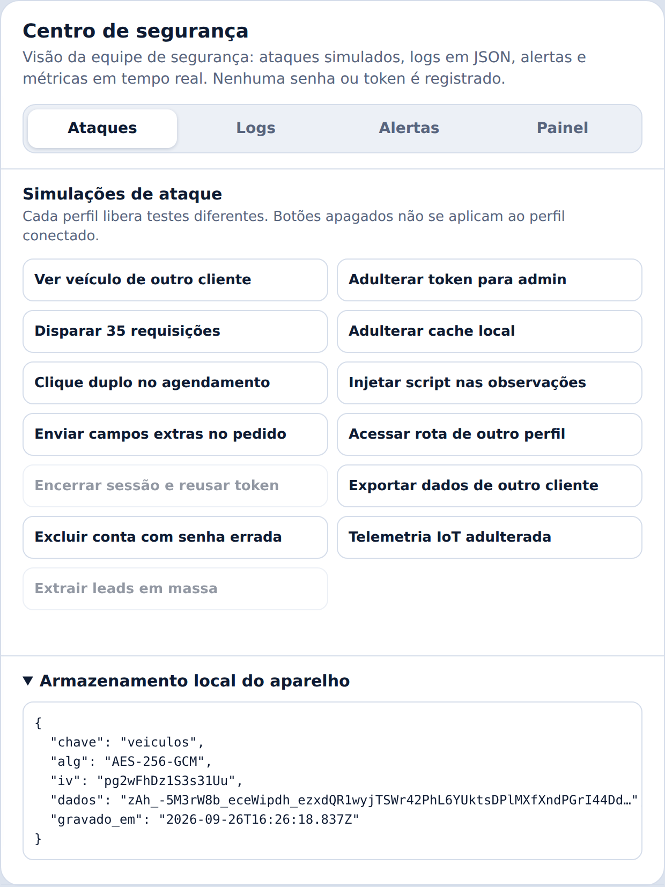
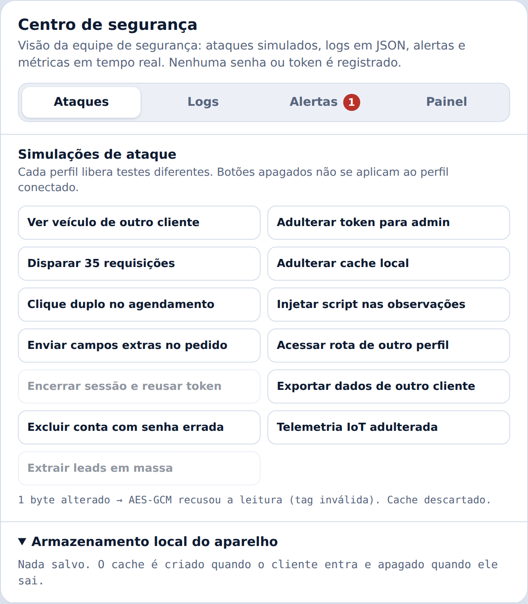
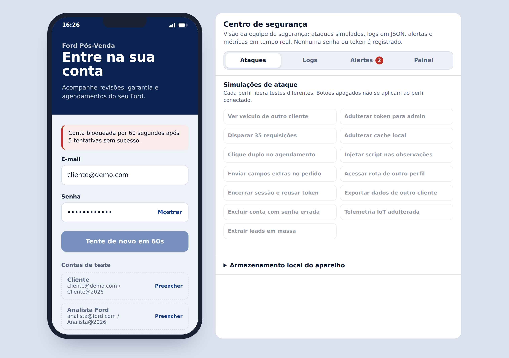
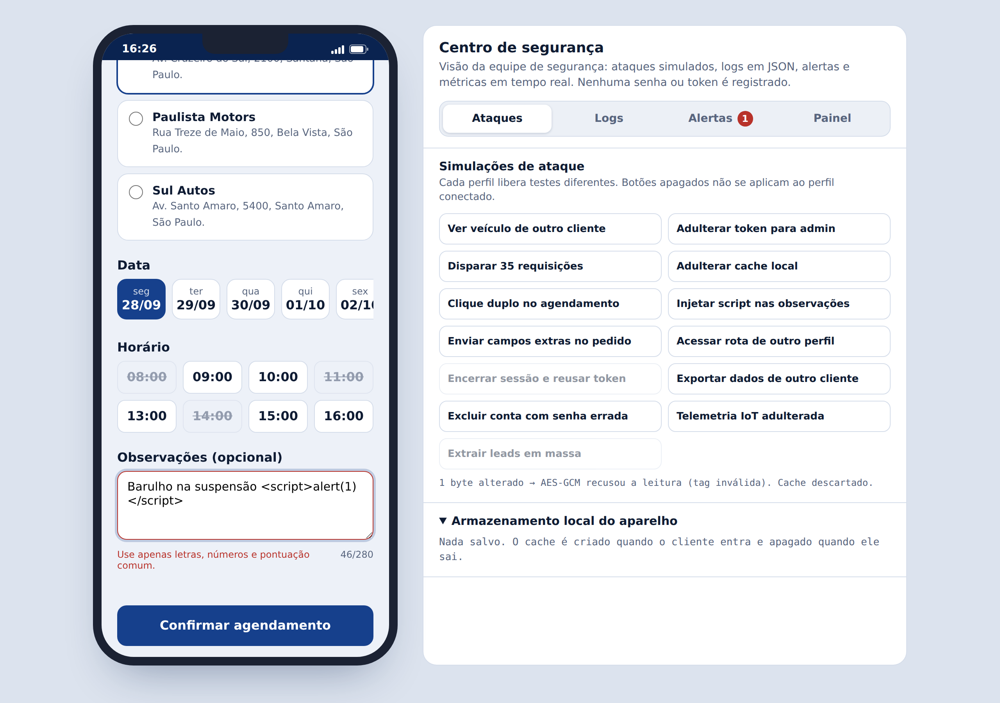
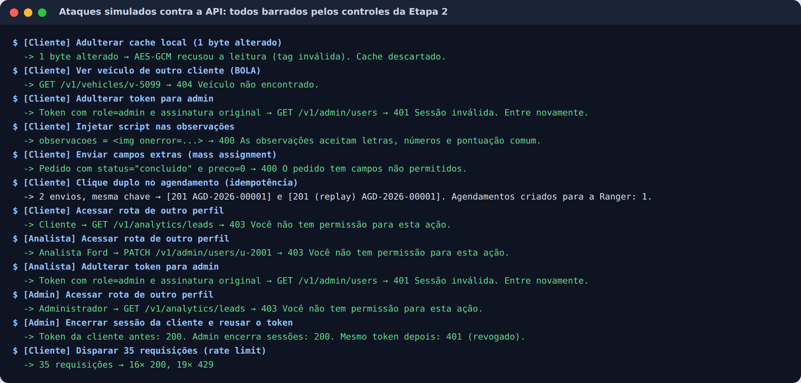
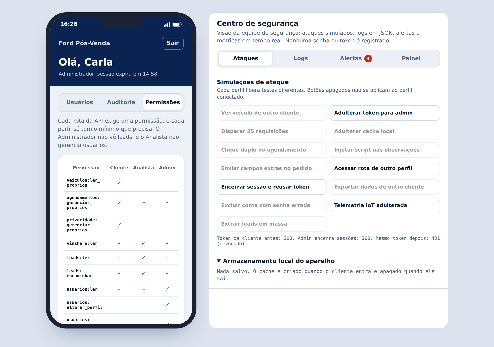
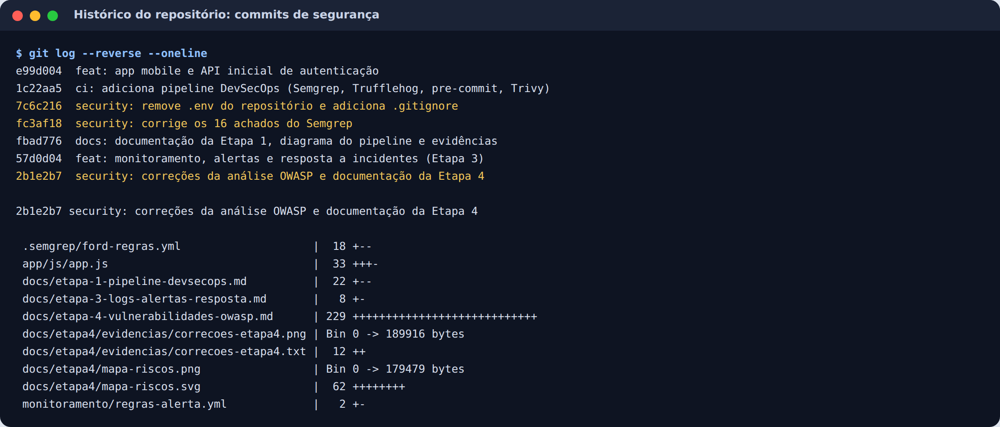

# Etapa 2: Segurança em Código e Infraestrutura

**Projeto:** Ford Pós-Venda (Desafio 02, VIN Share).
**Objetivo:** mostrar as práticas de segurança aplicadas diretamente no código e na infraestrutura, com trechos reais, prints dos controles funcionando e os commits em que entraram.

Todos os trechos abaixo estão em `app/js/app.js`, com a linha indicada, e rodam no protótipo publicado. Os prints vêm das simulações de ataque do Centro de Segurança.

---

## 1. Criptografia local

### 1.1 Cache do aparelho cifrado com AES-256-GCM

O app guarda os dados dos veículos no aparelho para funcionar sem conexão. Esses dados são gravados **cifrados**:

- **Chave:** gerada no login, **não exportável** (nem o próprio código consegue lê-la) e descartada no logout. No app nativo, ela fica no Android Keystore ou no iOS Keychain.
- **IV:** um novo a cada gravação. Repetir IV com a mesma chave quebra a segurança do GCM.
- **Integridade:** o GCM autentica os dados. Se um único byte for alterado, a leitura falha, o cache é descartado e o alerta ALR-10 dispara.

```javascript
// app/js/app.js, linha 650
async gravar(nome, obj) {
  if (!this.chave) await this.iniciar();
  const iv = crypto.getRandomValues(new Uint8Array(12)); // IV novo a cada gravação
  const cifrado = await crypto.subtle.encrypt({ name: 'AES-GCM', iv }, this.chave, enc.encode(JSON.stringify(obj)));
  this.armazenamento.set(nome, { alg: 'AES-256-GCM', iv: b64url(iv), dados: b64url(cifrado), gravado_em: new Date().toISOString() });
  ...
},

async ler(nome) {
  ...
  try {
    const claro = await crypto.subtle.decrypt({ name: 'AES-GCM', iv: b64urlParaBytes(e.iv) }, this.chave, b64urlParaBytes(e.dados));
    return JSON.parse(new TextDecoder().decode(claro));
  } catch {
    // A tag de autenticação do GCM não confere: dado foi alterado. Descarta.
    Log.registrar('storage.cache.integrity_fail', 'CRITICAL', { key: nome, action: 'cache_discarded' });
    this.armazenamento.delete(nome);
    ...
  }
}
```

No aparelho fica só texto cifrado:



Na simulação "Adulterar cache local", um byte foi alterado e o GCM recusou a leitura:



### 1.2 Senhas com PBKDF2 e comparação em tempo constante

- **Hash:** as senhas nunca ficam em texto puro. São guardadas como PBKDF2-HMAC-SHA256 com **600 mil iterações** (recomendação atual da OWASP) e salt único por usuário.
- **Anti-enumeração:** quando o e-mail não existe, o cálculo é feito do mesmo jeito com um salt falso. Assim o tempo de resposta não revela quais contas existem.
- **Tempo constante:** a comparação percorre sempre todos os caracteres, para não vazar informação pelo tempo.

```javascript
// app/js/app.js, linha 173
async function autenticar(email, senha) {
  const u = USUARIOS.find(x => x.email === email);
  const hash = await derivarHash(senha, u && u.salt ? u.salt : SALT_FALSO);
  return u && u.hash && iguaisTempoConstante(hash, u.hash) ? u : null;
}
```

### 1.3 Outras aplicações de criptografia no projeto

| Onde | Algoritmo | Para quê |
|---|---|---|
| Token de sessão (seção 7) | HMAC-SHA256 com chave não exportável | Impedir que o token seja alterado |
| Telemetria IoT (seção 24) | HMAC-SHA256 por dispositivo | Provar que a leitura veio do módulo do veículo |
| Pseudônimos dos leads (seção 18) | HMAC-SHA256 | Esconder o cliente do analista sem perder a consistência |
| Transporte | TLS 1.2+ com HSTS; MQTTS para o broker | Proteger os dados em trânsito |

---

## 2. Hardening da API

### 2.1 Rate limit

Cada usuário pode fazer até **30 requisições por minuto**. Acima disso, a API responde **429** e registra o evento **uma vez por janela**, para o próprio log não ser inundado. O login tem uma proteção própria: 5 falhas seguidas bloqueiam a conta por 60 segundos.

```javascript
// app/js/app.js, linha 534
function checarLimite(sub) {
  const agora = Date.now();
  let j = janelasApi.get(sub);
  if (!j || agora - j.inicio > LIMITE_API.janelaMs) {
    j = { inicio: agora, qtd: 0, avisado: false };
    janelasApi.set(sub, j);
  }
  j.qtd += 1;
  if (j.qtd <= LIMITE_API.max) return null;
  ...
  return { status: 429, erro: 'Muitas requisições. Tente novamente em instantes.', retry_after: retry };
}
```



### 2.2 Validação de entrada

A validação acontece **duas vezes**: no app, para dar retorno imediato ao usuário, e na API, que é quem garante. A API usa um esquema estrito:

- **Campos:** qualquer campo que não esteja na lista é recusado, o que barra *mass assignment*.
- **Valores:** serviço, concessionária, data e horário só aceitam itens de listas fechadas.
- **Texto livre:** passa por uma allowlist de caracteres, o que barra script.

```javascript
// app/js/app.js, linha 1014
function validarAgendamento(c) {
  if (!c || typeof c !== 'object' || Array.isArray(c))
    return { campo: 'body', motivo: 'invalid_body', msg: 'Dados do agendamento inválidos.' };
  const extras = Object.keys(c).filter(k => !CAMPOS_AGENDAMENTO.includes(k));
  if (extras.length)
    return { campo: extras.join(','), motivo: 'unexpected_fields', msg: 'O pedido tem campos não permitidos.' };
  if (typeof c.veiculo_id !== 'string' || !/^v-\d{4}$/.test(c.veiculo_id))
    return { campo: 'veiculo_id', motivo: 'invalid_format', msg: 'Veículo inválido.' };
  if (!Object.hasOwn(SERVICOS, c.servico))
    return { campo: 'servico', motivo: 'not_in_enum', msg: 'Escolha um tipo de serviço.' };
  if (!CONCESSIONARIAS.some(x => x.id === c.concessionaria_id))
    return { campo: 'concessionaria_id', motivo: 'not_in_enum', msg: 'Escolha uma concessionária.' };
  if (!diasDisponiveis().includes(c.data))
    return { campo: 'data', motivo: 'out_of_window', msg: 'Escolha uma das datas disponíveis.' };
  if (!HORARIOS.includes(c.hora))
    return { campo: 'hora', motivo: 'not_in_enum', msg: 'Escolha um horário.' };
  const obs = c.observacoes === undefined ? '' : c.observacoes;
  if (typeof obs !== 'string' || obs.length > OBS_MAX)
    return { campo: 'observacoes', motivo: 'too_long', msg: `As observações têm até ${OBS_MAX} caracteres.` };
  if (!REGEX_OBS.test(obs))
    return { campo: 'observacoes', motivo: 'disallowed_characters', msg: 'As observações aceitam letras, números e pontuação comum.' };
```

Na saída, todo dado que vem do usuário ou da API é inserido na tela com `textContent` (função `el()`, seção 13), nunca como HTML. A CSP com `script-src 'self'` é uma segunda barreira.



### 2.3 JWT seguro

| Controle | Por quê |
|---|---|
| Algoritmo fixo (HS256) na allowlist; `alg: none` recusado | Impede o ataque em que o invasor tira a assinatura do token |
| `typ`, `iss` e `aud` conferidos | Só aceita token deste emissor e para este serviço |
| Validade de 15 minutos (`exp`) | Limita o tempo de uso de um token roubado |
| Chave HMAC não exportável, gerada em tempo de execução | Não existe segredo escrito no código |
| Versão do usuário (`ver`) no token | Mudar o perfil ou encerrar as sessões invalida o token na hora |
| Payload sem dados pessoais | Token vazado não expõe nome, e-mail nem CPF |
| Token só em memória | Nada fica no `localStorage` para ser roubado |

```javascript
// app/js/app.js, linha 203
async function emitirToken(usuario) {
  const agora = Math.floor(Date.now() / 1000);
  const header = { alg: 'HS256', typ: 'JWT' };
  // ver = versão do token da conta. Quando o admin muda o perfil ou encerra as sessões, a versão sobe e tokens antigos morrem.
  const payload = { iss: JWT_ISS, aud: JWT_AUD, sub: usuario.id, role: usuario.perfil, ver: usuario.versaoToken, iat: agora, exp: agora + CONFIG.TOKEN_TTL_S, jti: crypto.randomUUID() };
  const base = b64urlJson(header) + '.' + b64urlJson(payload);
  const assinatura = await crypto.subtle.sign('HMAC', chaveJWT, enc.encode(base));
  return base + '.' + b64url(assinatura);
}

// app/js/app.js, linha 214 (verificação, na ordem em que acontece)
if (header.alg !== 'HS256') return { payload: null, motivo: 'alg_not_allowed' };
if (header.typ !== 'JWT') return { payload: null, motivo: 'malformed' };
const ok = await crypto.subtle.verify('HMAC', chaveJWT, b64urlParaBytes(s), enc.encode(h + '.' + p));
if (!ok) return { payload: null, motivo: antiga ? 'key_rotated' : 'signature_mismatch' };
if (payload.iss !== JWT_ISS || payload.aud !== JWT_AUD) return { payload: null, motivo: 'invalid_claims' };
if (typeof payload.exp !== 'number' || payload.exp <= Math.floor(Date.now() / 1000)) return { payload: null, motivo: 'expired' };
if (!dono || dono.versaoToken !== payload.ver || dono.perfil !== payload.role) return { payload: null, motivo: 'revoked' };
```

### 2.4 Outras proteções da API

- **Autorização por objeto:** cada rota com id confere se o recurso é de quem pede, e responde **404** em vez de 403, para não confirmar que o recurso existe (linha 609).
- **Idempotency key** no agendamento: dois envios iguais criam um único registro.
- **Falha fechada:** qualquer exceção inesperada vira um 500 genérico, sem detalhe interno (linha 558).
- **DTO mínimo:** a API nunca devolve o `ownerId`; o VIN sai mascarado e só aparece inteiro numa rota própria, com registro de auditoria.

### 2.5 Ataques simulados contra a API

Todos foram barrados pelos controles acima:



Sobre o rate limit: a janela é de 1 minuto por usuário, e parte da cota já tinha sido usada pela navegação anterior. Por isso, das 35 requisições, 16 passaram e 19 foram recusadas.

---

## 3. Controle de acesso por perfil (RBAC)

### 3.1 Perfis

O template da disciplina cita os perfis Brigadista, Gestor e Administrador, que vêm de outro cenário (brigada de incêndio). Para o Desafio 02 da Ford, adaptamos os perfis ao pós-venda, seguindo a sugestão da aula 07:

| Perfil | Equivale a | Acessa |
|---|---|---|
| **Cliente** | Usuário final | Só os próprios veículos, agendamentos e dados de privacidade |
| **Analista Ford** | Gestor | VIN Share agregado e leads pseudoanonimizados |
| **Administrador** | Administrador | Usuários, perfis, sessões e auditoria. **Não vê leads** (menor privilégio) |

### 3.2 Implementação

Cada rota da API exige uma **permissão**, e a matriz fica num único lugar. Não existe checagem espalhada do tipo `if (role === 'admin')`: toda rota chama `autorizar()`.

```javascript
// app/js/app.js, linha 1535
const PERMISSOES = {
  cliente:  ['veiculos:ler_proprios', 'agendamentos:gerenciar_proprios', 'privacidade:gerenciar_proprios'],
  analista: ['vinshare:ler', 'leads:ler', 'leads:encaminhar'],
  admin:    ['usuarios:ler', 'usuarios:alterar_perfil', 'usuarios:encerrar_sessoes', 'usuarios:desbloquear', 'auditoria:ler']
};

function autorizar(payload, permissao, rota) {
  ...
  if ((PERMISSOES[payload.role] || []).includes(permissao)) return null;
  Log.registrar('access.denied', 'WARN', { user_id: payload.sub, role: payload.role, route: rota, required_permission: permissao, reason: 'perfil_sem_permissao', status: 403 });
  return { status: 403, erro: 'Você não tem permissão para esta ação.' };
}
```

**Regras adicionais:**
- O perfil vem do token assinado. O app só esconde telas; quem decide é a API.
- Mudar o perfil de alguém **derruba as sessões** dessa pessoa na hora, pela versão do token.
- O administrador **não consegue alterar o próprio perfil**, o que evita autopromoção.

A matriz de permissões aparece na aba Permissões do Administrador:



Na simulação "Acessar rota de outro perfil", cada perfil tentou uma rota que não é sua e recebeu **403**:
- o Cliente pediu os leads;
- o Analista tentou se promover a admin;
- o Admin pediu os leads.

Na revogação, o token da cliente funcionava (200), o admin encerrou as sessões, e o mesmo token passou a receber **401**.

---

## 4. Infraestrutura

| Item | Configuração | Risco reduzido |
|---|---|---|
| `Dockerfile` | Base `nginx-unprivileged`, `USER 101`, Alpine, `HEALTHCHECK` | Invasão do servidor não vira root; menos pacotes vulneráveis |
| `.dockerignore` | Exclui `.env`, `.git`, `.semgrep` e `api` | Segredo e histórico fora da imagem |
| `nginx/default.conf` | CSP, HSTS, `X-Frame-Options DENY`, `nosniff`, `Referrer-Policy`, `Permissions-Policy`, `server_tokens off`, bloqueio de `/.` | XSS, clickjacking, downgrade para HTTP, exposição de arquivos |
| `app/index.html` | CSP também na página; JS e CSS em arquivos separados, sem script inline | XSS mesmo se algo escapar da validação |
| `.gitignore` e `.env.example` | Segredos fora do Git; modelo sem valores | Vazamento de credenciais (Etapa 1) |

---

## 5. Commits

Os controles entraram no repositório nestes commits, e cada um passou pelos hooks de pre-commit (Trufflehog e Semgrep):



| Commit | O que trouxe para a Etapa 2 |
|---|---|
| `fc3af18` | Trocou o código legado inseguro (MD5, `jwt.decode`, `localStorage`, `eval`, CORS `*`) pela implementação endurecida; corrigiu o `innerHTML` da tela de login |
| `57d0d04` | Suspensão de permissão, bloqueio de origem e quarentena usados na resposta a incidentes |
| `2b1e2b7` | `iss`, `aud` e `typ` no JWT; PBKDF2 com 600 mil iterações; API com falha fechada |

O protótipo foi construído em partes antes do repositório existir. Os controles de criptografia local, rate limit, validação e RBAC já estavam no primeiro commit do código atual (`e99d004`), e a evolução posterior está nos commits acima.
