# Etapa 3: Logs, Alertas e Resposta a Incidentes

**Projeto:** Ford Pós-Venda (Desafio 02, VIN Share).
**Objetivo:** mostrar como o sistema registra eventos críticos, como detecta um ataque a partir desses registros e como a equipe reage, seguindo o modelo SANS PICERL.

> **Sobre o ambiente.** Tudo nesta etapa roda de verdade no protótipo publicado: os logs, as 12 regras, o painel e o console de resposta. Os ataques foram disparados pelas simulações do Centro de Segurança, e os prints e registros abaixo vêm dessas execuções. Em produção, o mesmo desenho usa ferramentas de mercado (seção 1). Os tempos de resposta ficaram em segundos porque o cenário foi executado de forma automatizada; num incidente real, a meta é a da política de severidade (seção 3.3).

---

## 1. Arquitetura de monitoramento

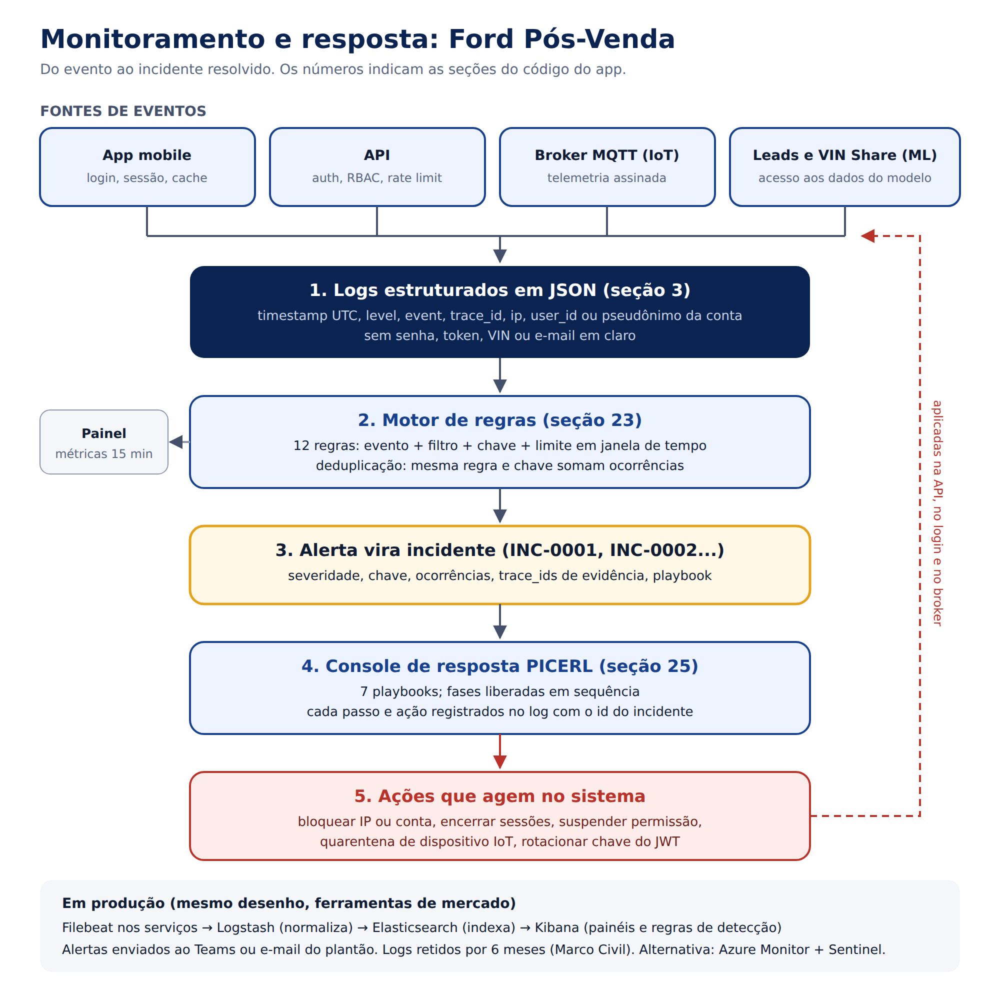

O fluxo tem cinco partes:

1. **Fontes:** app mobile, API, broker MQTT (telemetria IoT) e o serviço de leads (ML) geram eventos.
2. **Logs estruturados:** todo evento vira uma linha JSON no mesmo formato.
3. **Motor de regras:** cada linha passa por 12 regras em tempo real.
4. **Alerta vira incidente:** com severidade, evidências e playbook.
5. **Console de resposta:** conduz o incidente pelas fases do PICERL, e as ações de contenção agem de verdade na API, no login e no broker.

**Em produção.** O mesmo desenho segue o que a aula 18 apresenta com o ELK Stack:
- **Filebeat** coleta os logs nos serviços;
- **Logstash** normaliza;
- **Elasticsearch** indexa;
- **Kibana** mostra os painéis e roda as regras de detecção.

As 12 regras já estão escritas em KQL no arquivo `monitoramento/regras-alerta.yml`, prontas para o Kibana. Os alertas iriam para o Teams ou o e-mail do plantão. Uma alternativa em nuvem é o Azure Monitor com o Sentinel.

---

## 2. Logs estruturados

### 2.1 Formato

Todo evento tem os mesmos campos-base, o que permite buscar e correlacionar qualquer coisa pelo mesmo nome de campo:

| Campo | Conteúdo | Exemplo |
|---|---|---|
| `timestamp` | Data e hora em UTC, ISO 8601 | `2026-09-25T22:26:40.030Z` |
| `level` | `INFO`, `WARN` ou `CRITICAL` | `WARN` |
| `event` | Nome do evento em `dominio.acao` | `auth.login.failure` |
| `trace_id` | UUID único; liga o log ao alerta e ao incidente | `17cb30ab-...` |
| `source` | Quem gerou: `app-mobile`, `broker-mqtt`, `motor-alertas`, `console-resposta` | `app-mobile` |
| `ip` | Origem da requisição | `177.72.14.203` |
| Identificação | `user_id` (conta autenticada) ou `user` mascarado + `account_ref` (pseudônimo) | `c***@demo.com`, `acc-fe75337b` |

**O que nunca entra no log:** senha, token, VIN, e-mail em claro e o texto das observações do agendamento. Verificamos isso nos 113 eventos do cenário de teste: nenhum desses dados apareceu. Os logs ficam retidos por 6 meses, conforme o Marco Civil da Internet.

**Defeito encontrado e corrigido.** Na primeira versão, os logs de login usavam só o e-mail mascarado. Como `analista@ford.com` e `admin@ford.com` viram o mesmo `a***@ford.com`, o motor contava duas contas como uma, e um ataque de *password spraying* passava despercebido. Agora cada evento também leva `account_ref`, um pseudônimo estável da conta que diferencia as contas sem revelar o e-mail. Em produção, esse pseudônimo é um HMAC com chave guardada no cofre.

### 2.2 Eventos registrados

| Categoria | Eventos |
|---|---|
| **Login** | `auth.login.success`, `auth.login.failure`, `auth.login.invalid_input`, `auth.account.lockout`, `auth.logout`, `auth.token.expired` |
| **Falhas de autenticação na API** | `api.auth.rejected` (motivo: `signature_mismatch`, `alg_not_allowed`, `expired`, `revoked`, `key_rotated`) |
| **Autorização** | `access.denied`, `api.authz.bola_attempt`, `access.denied_suspended` |
| **Alterações críticas** | `admin.user.role_changed`, `admin.user.sessions_revoked`, `admin.user.unlocked`, `privacy.account_deleted`, `privacy.consent.revoked` |
| **Dados** | `data.access`, `data.sensitive.read`, `privacy.data_export`, `data.location.used` |
| **Mobile** | `storage.cache.write`, `storage.cache.integrity_fail` |
| **IoT** | `iot.telemetry.accepted`, `iot.telemetry.rejected`, `iot.telemetry.quarantined`, `iot.telemetry.discarded` |
| **Proteções** | `api.rate_limited`, `api.input.rejected`, `waf.blocked` |
| **Segurança** | `alert.triggered`, `ir.step.completed`, `ir.phase.completed`, `ir.action.executed`, `ir.incident.closed` |

### 2.3 Exemplos reais

Extraídos do cenário de teste. O arquivo completo está em `docs/etapa3/exemplos-logs.json`.

**Falha de autenticação**
```json
{
  "timestamp": "2026-09-25T22:26:40.030Z",
  "level": "WARN",
  "event": "auth.login.failure",
  "trace_id": "17cb30ab-2b52-44c7-ac24-958a3417409e",
  "source": "app-mobile",
  "ip": "177.72.14.203",
  "app_version": "0.7.0",
  "user": "c***@demo.com",
  "account_ref": "acc-fe75337b",
  "outcome": "invalid_credentials",
  "attempts_left": 4
}
```

**Alteração crítica: perfil de usuário promovido a administrador**
```json
{
  "timestamp": "2026-09-25T22:26:59.356Z",
  "level": "WARN",
  "event": "admin.user.role_changed",
  "trace_id": "a31cb643-39af-4e8b-bb37-b3010cdb0fc6",
  "source": "app-mobile",
  "ip": "177.72.14.203",
  "app_version": "0.7.0",
  "user_id": "u-9001",
  "target_user": "u-2002",
  "from": "analista",
  "to": "admin",
  "sessions_revoked": true,
  "audit": true,
  "status": 200
}
```

**IoT: odômetro voltando 1.500 km (módulo telemático adulterado)**
```json
{
  "timestamp": "2026-09-25T22:26:43.973Z",
  "level": "WARN",
  "event": "iot.telemetry.rejected",
  "trace_id": "68c706a3-feca-4ee8-84ed-ccab0fe0628c",
  "source": "broker-mqtt",
  "ip": "10.20.0.15",
  "app_version": "0.7.0",
  "device_id": "tcu-5001",
  "reason": "odometer_rollback",
  "km_previous": 38422,
  "km_received": 36920
}
```

**Alerta gerado pelo motor**, com o mesmo instante do evento acima:
```json
{
  "timestamp": "2026-09-25T22:26:43.974Z",
  "level": "CRITICAL",
  "event": "alert.triggered",
  "trace_id": "bad107b3-4c86-4921-8e00-d7ca9fac73bb",
  "source": "motor-alertas",
  "app_version": "0.7.0",
  "alert_id": "INC-0004",
  "rule_id": "ALR-11",
  "severity": "alta",
  "domain": "IoT",
  "key": "tcu-5001",
  "occurrences": 1
}
```

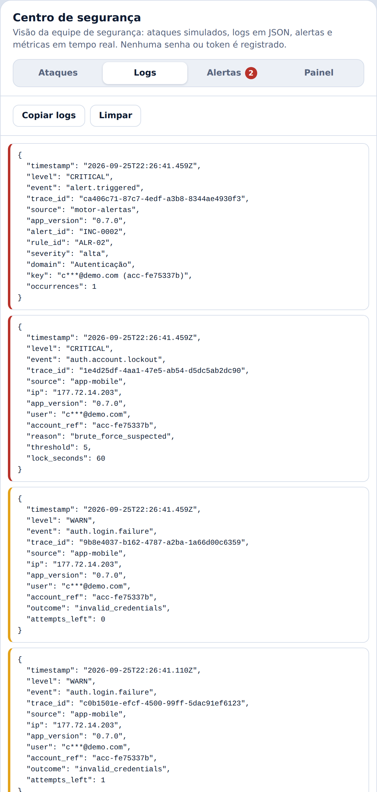

---

## 3. Métricas e alertas

### 3.1 Métricas por domínio

| Domínio | Métrica | Situação | Gatilho |
|---|---|---|---|
| **API** | Respostas 401 e 403 por minuto | Implementada | ALR-04, 05, 06 |
| | Respostas 429 (rate limit) | Implementada | ALR-07 |
| | Taxa de erros 5xx | Planejada | Acima de 2% por 5 min |
| | Latência p95 | Planejada | Acima de 800 ms por 5 min |
| **Mobile** | Falhas de integridade do cache cifrado | Implementada | ALR-10 |
| | Taxa de falhas (crash) do app | Planejada | Acima de 1% das sessões |
| **IoT** | Telemetria rejeitada, por motivo | Implementada | ALR-11 |
| | Dispositivos sem enviar dados | Planejada | Mais de 24 h sem leitura |
| | Falhas de TLS e desconexões no broker MQTT | Planejada | Acima de 5% em 10 min |
| **ML** | Leituras de leads por usuário | Implementada | ALR-08 |
| | Desvio (drift) do score do modelo | Planejada | PSI acima de 0,2 na comparação semanal |
| | Conversão de leads em agendamento | Planejada | Queda acima de 30% no mês |
| **Autenticação** | Falhas de login, bloqueios e spraying | Implementada | ALR-01, 02, 03 |

As métricas planejadas dependem da infraestrutura de produção (APM, Crashlytics, broker real, pipeline do modelo) e já estão no catálogo com os limites definidos.

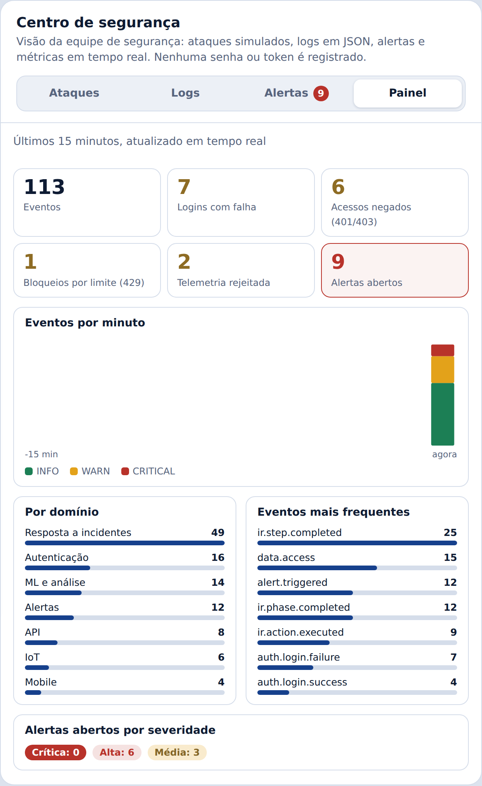

### 3.2 Regras de alerta

| ID | Gatilho | Limite e janela | Severidade | Playbook |
|---|---|---|---|---|
| ALR-01 | Falhas de login na mesma conta | 3 em 5 min | Média | PB-01 |
| ALR-02 | Conta bloqueada por força bruta | 1 evento | Alta | PB-01 |
| ALR-03 | Falhas em contas diferentes, mesma origem (*spraying*) | 3 contas em 5 min | Alta | PB-01 |
| ALR-04 | Token com assinatura inválida ou `alg` proibido | 1 evento | **Crítica** | PB-02 |
| ALR-05 | Pedido de veículo ou agendamento de outro cliente (BOLA) | 1 evento | Alta | PB-03 |
| ALR-06 | Acesso negado por perfil | 2 em 10 min | Alta | PB-03 |
| ALR-07 | Rate limit atingido | 1 evento | Média | PB-05 |
| ALR-08 | Leituras de leads pelo mesmo usuário | 5 em 5 min | Alta | PB-03 |
| ALR-09 | Perfil de usuário alterado | 1 evento | Média; Alta se virar admin | PB-04 |
| ALR-10 | Cache local com integridade violada | 1 evento | Alta | PB-06 |
| ALR-11 | Telemetria IoT rejeitada | 1 evento | Alta | PB-07 |
| ALR-12 | Exclusão de conta com senha errada | 1 evento | Média | PB-01 |

**Deduplicação.** Se a mesma regra dispara de novo para a mesma chave (conta, IP ou dispositivo) enquanto o incidente está aberto, o sistema soma a ocorrência em vez de abrir outro incidente. Isso evita que um único ataque gere dezenas de alertas.

**Prevenção e detecção são camadas diferentes.** Na simulação de extração de leads, o analista fez 12 consultas seguidas. O rate limit (30 por minuto) não barrou, porque cada requisição isolada é legítima. Mas a regra ALR-08 disparou na quinta consulta. Um controle impede o abuso óbvio; o monitoramento pega o abuso que parece uso normal.

**Consultas KQL para o Kibana** (todas no catálogo):
```
ALR-04  event: "api.auth.rejected" and reason: ("signature_mismatch" or "alg_not_allowed" or "malformed")
ALR-03  event: "auth.login.failure"   | agrupar por ip, contar account_ref distintos >= 3 em 5 min
ALR-08  event: "data.access" and route: "/v1/analytics/leads"   | agrupar por user_id, >= 5 em 5 min
```

**Teste das regras.** No cenário completo, as 12 regras dispararam, cada uma com a chave correta.

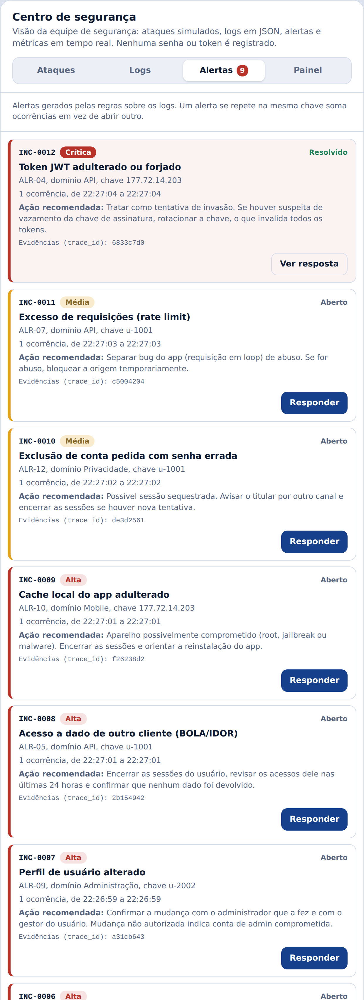

### 3.3 Política de severidade

| Severidade | Início da resposta | Quem é avisado |
|---|---|---|
| Crítica | Até 15 min, 24x7 | Plantão, dono do sistema e DPO |
| Alta | Até 1 h | Plantão e dono do sistema |
| Média | Até 4 h (horário comercial) | Plantão |

---

## 4. Plano de resposta a incidentes (SANS PICERL)

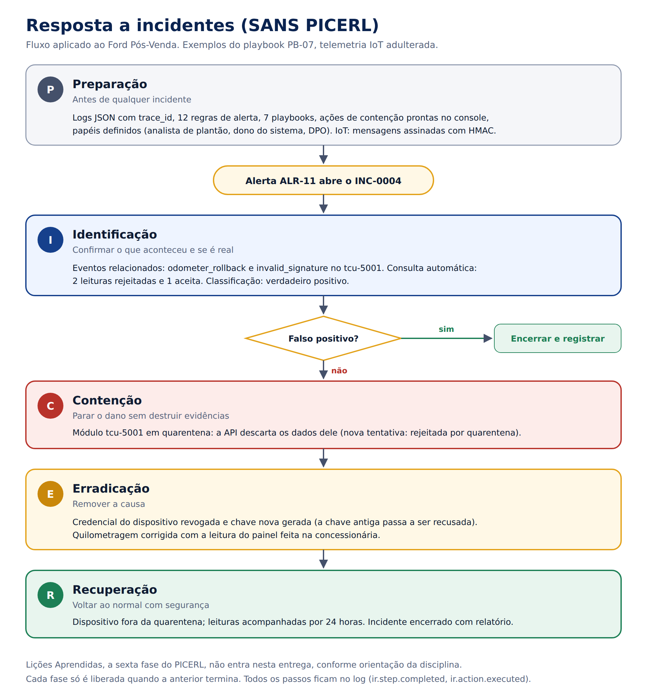

### 4.1 Como o plano funciona

- **Uma regra, um playbook.** Cada alerta abre um incidente (`INC-0001`, `INC-0002`...) já ligado ao playbook do tipo de ataque.
- **Fases em sequência.** A fase seguinte só é liberada quando a anterior termina. Não dá para erradicar antes de conter.
- **Falso positivo.** Na Identificação, o analista classifica o alerta. Se for falso positivo, o incidente é encerrado sem nenhuma ação de contenção.
- **Rastreabilidade.** Cada passo e cada ação ficam no log com o id do incidente, e aparecem na trilha de auditoria do Administrador.
- **Métricas.** O console mede o tempo até a contenção e até o encerramento, e gera um relatório do incidente em JSON.

**Papéis:**
- **Analista de plantão:** conduz o incidente.
- **Dono do sistema:** aprova ações que afetam usuários.
- **DPO:** avalia se é preciso comunicar a ANPD e os titulares (LGPD, art. 48).

### 4.2 As fases no projeto

| Fase | O que significa aqui |
|---|---|
| **Preparação** | O que já existe antes do incidente: logs com trace_id, 12 regras, 7 playbooks, ações de contenção prontas no console e papéis definidos |
| **Identificação** | Eventos relacionados ao alerta, consultas automáticas nos logs e classificação como verdadeiro ou falso positivo |
| **Contenção** | Parar o dano sem apagar evidências: bloquear IP ou conta, encerrar sessões, suspender permissão, quarentena de dispositivo |
| **Erradicação** | Remover a causa: rotacionar chaves, revogar credencial do dispositivo, trocar senhas, revisar vazamentos |
| **Recuperação** | Voltar ao normal com segurança: liberar o que foi bloqueado e acompanhar por um período |

A fase de Lições Aprendidas não entra nesta entrega, conforme a orientação da disciplina.

### 4.3 Playbooks

| Playbook | Alertas | Contenção | Erradicação | Recuperação |
|---|---|---|---|---|
| PB-01 Ataque a credenciais | ALR-01, 02, 03, 12 | Bloquear a conta, ou o IP no caso de spraying | Confirmar com o titular por outro canal e exigir troca de senha | Liberar e observar por 24 h |
| PB-02 Token JWT forjado | ALR-04 | Bloquear o IP | Verificar vazamento da chave (Trufflehog) e **rotacionar a chave do JWT** | Liberar o IP e confirmar novos logins |
| PB-03 Acesso indevido a dados | ALR-05, 06, 08 | Encerrar sessões; suspender a permissão de leads | Gestor confirma a causa; DPO avalia a comunicação (LGPD, art. 48) | Devolver a permissão e observar por 7 dias |
| PB-04 Alteração de privilégio | ALR-09 | **Reverter o perfil** e encerrar as sessões do admin | Trocar a senha do admin e revisar as ações dele | Gestor confirma o perfil correto |
| PB-05 Abuso de API | ALR-07 | Suspender o usuário por 30 min | Separar bug do app de abuso | Liberar |
| PB-06 Aparelho comprometido | ALR-10 | Apagar o cache e encerrar a sessão | Reinstalar o app pela loja oficial | Novo login gera chave AES nova |
| PB-07 Telemetria IoT adulterada | ALR-11 | **Quarentena do dispositivo** | **Revogar a credencial** e corrigir o km na concessionária | Retirar da quarentena e observar por 24 h |

---

## 5. Incidente aplicado ao projeto: telemetria IoT adulterada

**Cenário.** O módulo telemático da Ranger (`tcu-5001`) enviou uma leitura com o odômetro 1.500 km menor, assinada com a chave verdadeira. Isso indica um módulo comprometido ou adulteração de quilometragem, que afeta garantia e revisões. Em seguida veio outra mensagem com assinatura falsa. A API rejeitou as duas, e a regra ALR-11 abriu o **INC-0004**.

**Identificação.** O analista revisou os eventos relacionados (`odometer_rollback` e `invalid_signature`). A consulta automática mostrou 2 leituras rejeitadas e 1 aceita, e o alerta foi classificado como verdadeiro positivo.

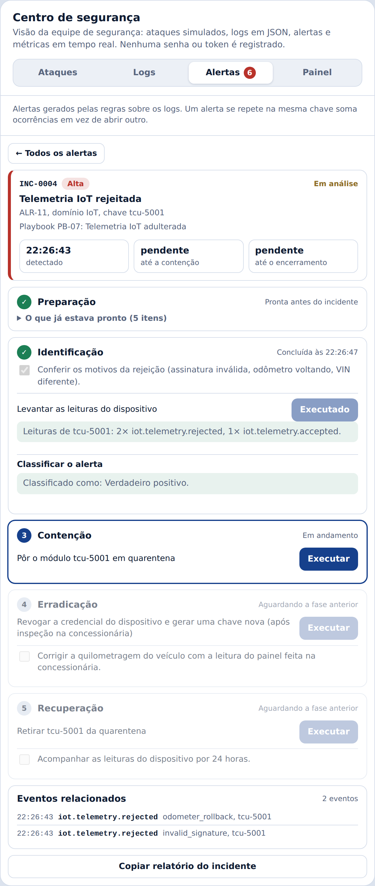

**Contenção.** O dispositivo foi posto em quarentena. Para comprovar, a mesma simulação foi rodada de novo: **todas** as mensagens, inclusive a legítima, foram descartadas com o motivo "quarentena".

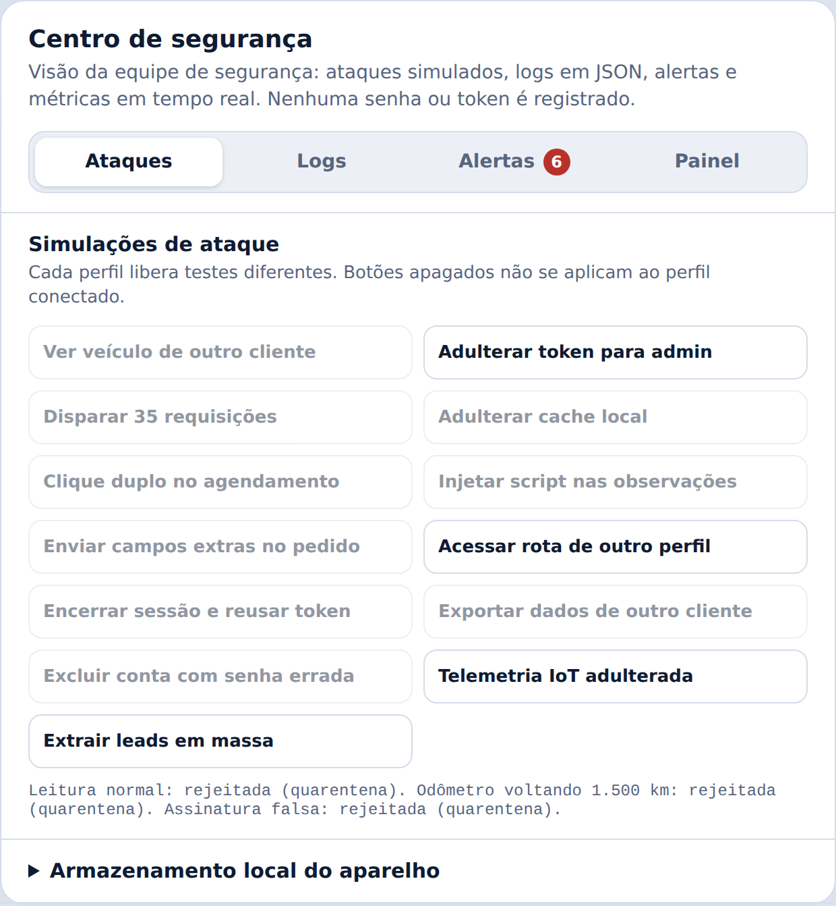

**Erradicação.** A credencial do dispositivo foi revogada, e uma chave nova foi gerada. Mensagens assinadas com a chave antiga passam a ser recusadas. A quilometragem é corrigida com a leitura do painel feita na concessionária.

**Recuperação.** O dispositivo saiu da quarentena. Na simulação seguinte, a leitura legítima voltou a ser aceita, e o odômetro voltando continuou sendo rejeitado. O incidente foi encerrado.

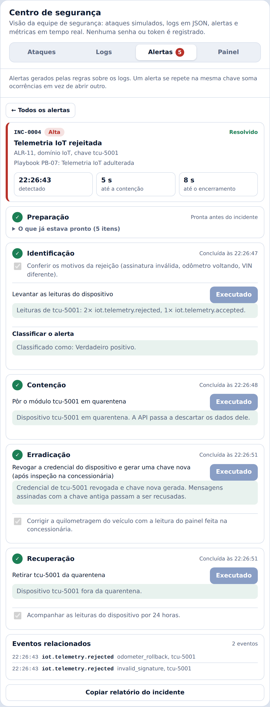

**Relatório do incidente** (resumo; o completo está em `docs/etapa3/relatorio-incidente-iot.json`):
```json
{
  "incidente": "INC-0004",
  "regra": "ALR-11",
  "playbook": "PB-07 Telemetria IoT adulterada",
  "status": "resolvido",
  "detectado_em": "2026-09-25T22:26:43.973Z",
  "fases_concluidas": {
    "identificacao": "2026-09-25T22:26:47.791Z",
    "contencao": "2026-09-25T22:26:48.827Z",
    "erradicacao": "2026-09-25T22:26:51.076Z",
    "recuperacao": "2026-09-25T22:26:51.793Z"
  },
  "metricas": {
    "tempo_ate_contencao_s": 5,
    "tempo_ate_resolucao_s": 8
  }
}
```

### 5.1 Outros incidentes testados

**PB-03, extração de leads.** A contenção encerrou a sessão do analista e suspendeu a permissão `leads:ler`. Ao entrar de novo, ele recebeu "Acesso suspenso pela equipe de segurança". Na recuperação, a permissão foi devolvida e os leads voltaram a aparecer.

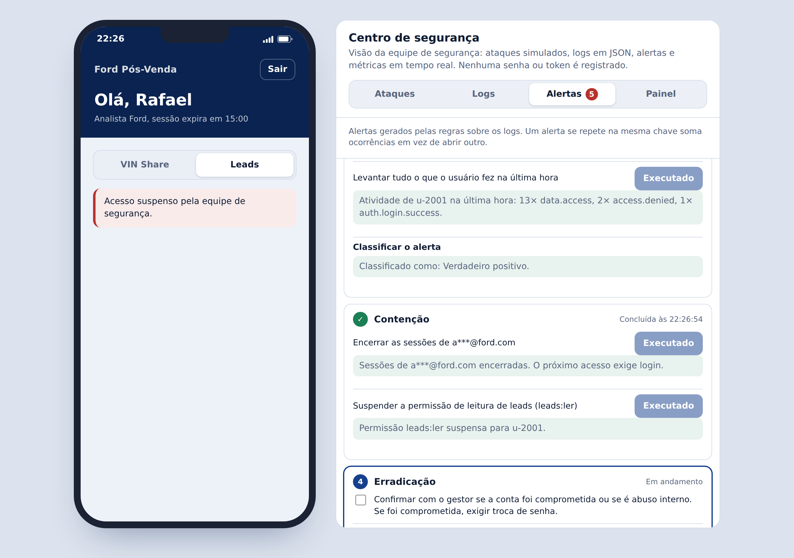

**PB-02, token forjado.** A contenção bloqueou o IP de origem. Nem o login funcionava a partir dele. Na erradicação, a chave do JWT foi rotacionada; depois da liberação, a cliente entrou normalmente.

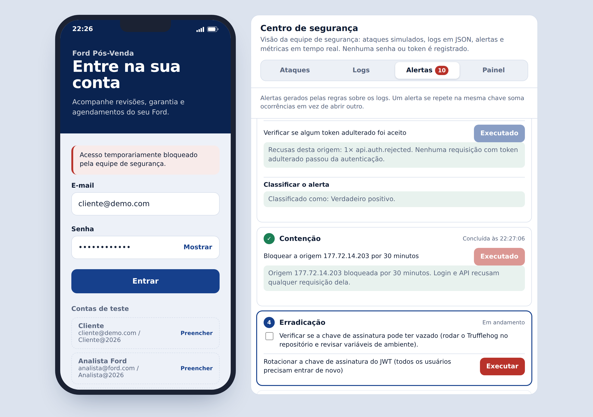

**Um cuidado com a rotação de chave.** Rotacionar a chave invalida o token de todos os usuários. Sem tratamento, cada usuário legítimo com token antigo dispararia um alerta crítico de "token forjado". O sistema guarda a chave anterior só para reconhecer esses tokens: eles são recusados com o motivo `key_rotated`, em nível INFO, sem alerta. Testamos: token antigo recusado com 401 e nenhum ALR-04 novo.

**Trilha de auditoria.** O Administrador vê, na aba Auditoria, os alertas e as ações de resposta junto com os demais eventos críticos.

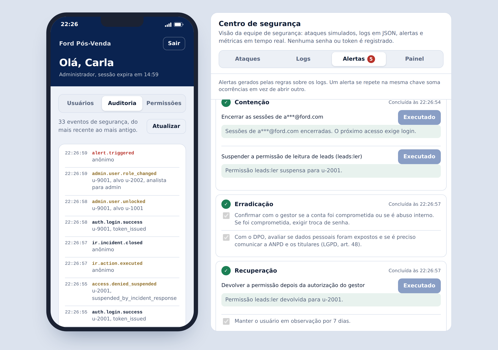

---

## 6. Limitações e próximos passos

- **Persistência:** no protótipo, logs e incidentes ficam na memória da página. Em produção, vão para o Elasticsearch com retenção de 6 meses e armazenamento que não permite alteração (WORM), para servirem de evidência.
- **Notificação:** no protótipo, o alerta aparece no console. Em produção, ele também vai para o Teams, o e-mail ou a ferramenta de plantão, conforme a severidade.
- **Relógio:** a correlação depende de horário confiável. Em produção, todos os servidores e o broker sincronizam por NTP.
- **Métricas planejadas:** latência, 5xx, crash do app, saúde do broker e drift do modelo entram com a infraestrutura de produção, com os limites já definidos no catálogo.
