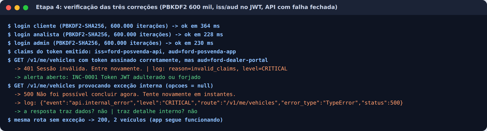
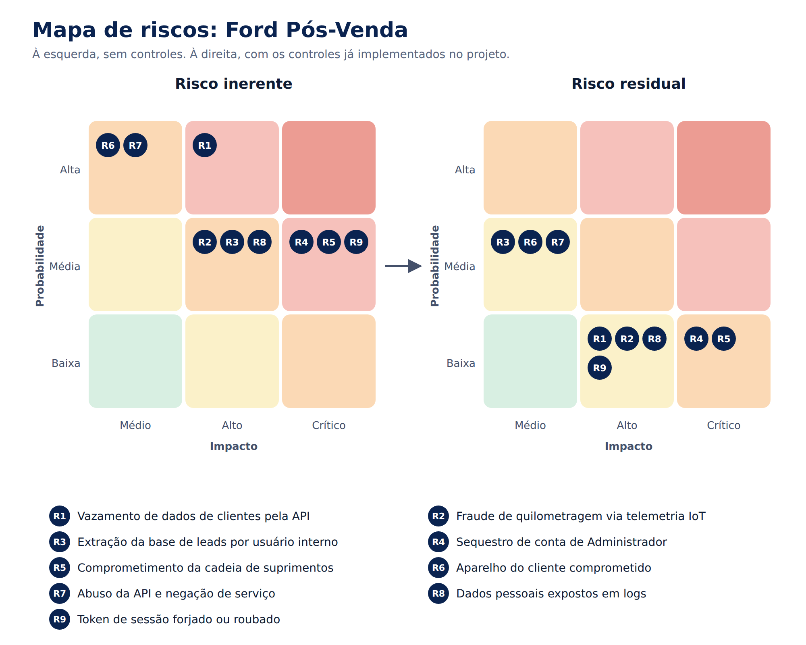

# Etapa 4: Pesquisa de Vulnerabilidades (OWASP)

**Projeto:** Ford Pós-Venda (Desafio 02, VIN Share).
**Objetivo:** identificar quais riscos dos padrões OWASP se aplicam à solução, mostrar como cada um já é tratado (com o lugar no código e a evidência) e definir o plano de mitigação do que falta.

**Componentes analisados:**
- app mobile (protótipo em HTML; o app nativo é a evolução prevista);
- API;
- ingestão de telemetria IoT (módulo telemático → broker MQTT/TLS → API);
- serviço de leads e VIN Share (ML e análise);
- pipeline de CI/CD.

## Padrões e versões usados

| Padrão | Versão | Uso nesta análise |
|---|---|---|
| OWASP Top 10 | **2025** (finalizada em janeiro de 2026) | Riscos gerais da aplicação |
| OWASP API Security Top 10 | **2023** (edição vigente) | Riscos das APIs do projeto |
| OWASP Mobile Top 10 | **2024** | Riscos do app mobile |
| OWASP ASVS | **5.0.0** (maio de 2025) | Nível-alvo e requisitos de verificação |

As referências das etapas anteriores (regras Semgrep, textos das Etapas 1 e 3) foram atualizadas da numeração do Top 10:2021 para a de 2025. O ASVS 5.0 deixa o mobile fora do escopo; para o app nativo, a referência de verificação é o **OWASP MASVS**.

**Legenda da situação:** ✅ tratado, com evidência · 🟡 parcial · 📋 planejado · ➖ não se aplica hoje.

---

## 1. O que esta análise encontrou e já corrigiu

Ao cruzar o código com os padrões, encontramos três lacunas reais e as corrigimos antes de montar as matrizes:

| Lacuna | Padrão | Correção |
|---|---|---|
| O token JWT não dizia quem o emitiu nem para qual serviço servia. Um token assinado pela mesma chave para outro sistema seria aceito | ASVS V9.2; API2:2023 | Claims `iss` e `aud` incluídas e conferidas; `typ` conferido no cabeçalho. Token para outro serviço é recusado com `invalid_claims` e dispara o alerta ALR-04 |
| PBKDF2 com 100 mil iterações, abaixo da recomendação da OWASP para PBKDF2-HMAC-SHA256 (600 mil) | A04:2025; M10:2024 | 600 mil iterações. O cálculo do hash passou de 15 para cerca de 80 ms: imperceptível para o usuário, 6 vezes mais caro para quem tenta quebrar uma senha vazada |
| Uma exceção inesperada dentro da API subia até a interface, sem resposta controlada | **A10:2025** (categoria nova) | A API passou a "falhar fechada": qualquer erro inesperado vira um 500 genérico, sem dados parciais nem detalhe interno, com log `api.internal_error` |

---

## 2. OWASP Top 10:2025

| Categoria | Como aparece no projeto | O que já protege (seção do código) | Situação | O que falta |
|---|---|---|---|---|
| **A01 Broken Access Control** | Cliente pedindo veículo ou agendamento de outro; analista chamando rotas de admin; admin lendo leads | Checagem de dono em toda rota, com 404 em vez de 403 (11, 15, 21); RBAC central `autorizar()` com menor privilégio (18); token versionado, que revoga o acesso na hora (7); rotas `/me` usam só o id do token (21); admin não altera o próprio perfil | ✅ | Hoje não há SSRF (agora parte do A01); ao integrar sistemas das concessionárias, usar lista de destinos permitidos |
| **A02 Security Misconfiguration** | Cabeçalhos, CORS, páginas de erro, arquivos expostos | CSP com `script-src 'self'`, HSTS, `X-Frame-Options`, `nosniff`; `server_tokens off` e bloqueio de `/.` no nginx; CORS fechado; sem endpoint de debug (regra Semgrep) | 🟡 | `'unsafe-inline'` em estilos (risco aceito); fontes carregadas do Google (terceiro e envio do IP do usuário) |
| **A03 Software Supply Chain Failures** | Actions do pipeline, imagem base, bibliotecas futuras | Actions fixadas por hash de commit; Dependabot; Trivy; Trufflehog; pre-commit (Etapa 1) | 🟡 | SBOM e assinatura da imagem; revisão obrigatória de PR |
| **A04 Cryptographic Failures** | Senhas, sessão, cache no aparelho, telemetria | PBKDF2-SHA256 com 600 mil iterações e salt (6); AES-256-GCM com IV aleatório (12); HMAC-SHA256 no JWT e na telemetria (7, 24); chaves não exportáveis; TLS e MQTTS | ✅ | Em produção: chaves em cofre (Key Vault ou HSM) com rotação agendada |
| **A05 Injection** | XSS pelo nome do cliente ou pelas observações do agendamento; SQL quando houver banco | `el()` com `textContent` (13); allowlist de caracteres e listas fechadas (15); CSP; regras Semgrep de XSS e `eval` | ✅ | Na API real: consultas parametrizadas e regra Semgrep para SQL concatenado |
| **A06 Insecure Design** | Abuso das regras de negócio: agendar em duplicidade, fraudar km, extrair leads | Idempotency key e 1 agendamento ativo por veículo (15); plausibilidade do odômetro (24); consentimento como condição de uso (21); pseudonimização por padrão (18); reautenticação na exclusão (21) | ✅ | Revisar a modelagem de ameaças (STRIDE) a cada sprint |
| **A07 Authentication Failures** | Força bruta, spraying, enumeração de contas | Bloqueio após 5 falhas (5); mensagem genérica e tempo constante, inclusive para e-mail inexistente (6); sessão de 15 min (1); reautenticação para ação irreversível; alertas ALR-01 a 03 | 🟡 | **MFA** para Admin e Analista; limite por IP no login (o spraying é detectado, mas não barrado) |
| **A08 Software or Data Integrity Failures** | Telemetria adulterada, cache adulterado, token alterado | HMAC da telemetria (24); tag do AES-GCM (12); assinatura do JWT (7); rejeição e alerta em cada caso | ✅ | Assinatura da imagem no deploy |
| **A09 Security Logging & Alerting Failures** | Ataque sem registro ou sem alerta | Logs JSON sem dados pessoais (3); 12 regras de alerta (23); console de resposta (25); Etapa 3 completa | ✅ | Envio de alertas para Teams ou e-mail; armazenamento imutável |
| **A10 Mishandling of Exceptional Conditions** | Erro que deixa passar em vez de bloquear | Falha fechada em todo ponto: token com erro é recusado (7); cache que não decifra é descartado (12); telemetria com assinatura ilegível é rejeitada (24); API com 500 genérico (11) | ✅ | — |

**Resumo:** 7 categorias tratadas e 3 parciais.

---

## 3. OWASP API Security Top 10:2023

### 3.1 Inventário das APIs

Manter o inventário atualizado é o próprio controle do API9.

| Método e rota | Perfil (permissão) | Proteções específicas |
|---|---|---|
| `GET /v1/me/vehicles` | Cliente | Filtra pelo dono; DTO sem `ownerId`; VIN mascarado |
| `GET /v1/vehicles/{id}` e `/{id}/vin` | Cliente | Formato do id validado; checagem de dono (404); leitura do VIN auditada |
| `GET /v1/dealers` e `/{id}/slots` | Qualquer perfil autenticado | Parâmetros validados; distância só com consentimento de localização |
| `POST /v1/appointments` | Cliente | Idempotency key; esquema estrito; listas fechadas; checagem de dono |
| `DELETE /v1/appointments/{id}` | Cliente | Checagem de dono |
| `GET /v1/analytics/vin-share` | Analista (`vinshare:ler`) | Só números agregados |
| `GET /v1/analytics/leads` | Analista (`leads:ler`) | Pseudônimos; alerta de leitura em massa |
| `POST /v1/leads/{id}/forward` | Analista (`leads:encaminhar`) | Bloqueado sem consentimento de contato |
| `GET/PATCH /v1/admin/users…`, `…/revoke-sessions`, `…/unlock` | Admin | Admin não altera a si mesmo; mudança derruba sessões |
| `GET /v1/admin/audit` | Admin (`auditoria:ler`) | Acesso à auditoria também é auditado |
| `GET/PUT /v1/me/consents`, `GET /v1/me/data-export`, `POST /v1/me/deletion` | Cliente | Titular vem só do token; exclusão exige senha |
| Ingestão de telemetria (MQTT → API) | Dispositivo | HMAC, VIN, anti-replay, plausibilidade, quarentena |

### 3.2 Matriz

| Risco | No cenário | Controles e evidência | Situação | Recomendação |
|---|---|---|---|---|
| **API1 Broken Object Level Authorization** | Trocar `v-5001` por `v-5099` na URL | Checagem de dono em todas as rotas com id; 404 para não confirmar a existência. Simulação "Ver veículo de outro cliente": 404 e alerta ALR-05 | ✅ | Manter teste automatizado de BOLA para toda rota nova |
| **API2 Broken Authentication** | Token forjado, sem expiração ou de outro serviço | HS256 em allowlist, `typ`, `iss`, `aud`, `exp` e versão conferidos; bloqueio de conta; rotação de chave. Simulação "Adulterar token": 401 e ALR-04 | ✅ | MFA (ver A07) |
| **API3 Broken Object Property Level Authorization** | Enviar `status` ou `preco` no agendamento; ver o dono do veículo | DTO mínimo (sem `ownerId`, VIN mascarado); esquema estrito recusa campo extra; PATCH de perfil aceita só `perfil`. Simulação "Campos extras": 400 | ✅ | — |
| **API4 Unrestricted Resource Consumption** | Flood de requisições; listas grandes | 30 requisições por minuto por usuário; limite de texto; janela de datas. Simulação "35 requisições": 429 e ALR-07 | 🟡 | Limite por IP no gateway; **paginação** em `/v1/analytics/leads` (hoje devolve a lista inteira); tamanho máximo do corpo |
| **API5 Broken Function Level Authorization** | Analista chamando rota de admin | Cada rota exige uma permissão (`autorizar()`); admin sem acesso a leads. Simulação "Acessar rota de outro perfil": 403 nos três perfis | ✅ | — |
| **API6 Unrestricted Access to Sensitive Business Flows** | Reservar todos os horários; extrair a base de leads | Idempotência; 1 agendamento ativo por veículo; alerta ALR-08 de leitura em massa | 🟡 | Limite de agendamentos por conta e dia; teto de encaminhamentos por analista |
| **API7 Server Side Request Forgery** | Nenhuma rota busca URL informada pelo usuário | — | ➖ | Ao integrar sistemas externos: lista de destinos permitidos e bloqueio de IPs internos |
| **API8 Security Misconfiguration** | CORS aberto, erro detalhado | CORS fechado; mensagens de erro genéricas; cabeçalhos de segurança; TLS | ✅ | — |
| **API9 Improper Inventory Management** | Rota esquecida ou versão antiga exposta | Versionamento `/v1`; inventário acima | 🟡 | Especificação OpenAPI; gateway que só expõe rotas documentadas; desligar versões antigas |
| **API10 Unsafe Consumption of APIs** | Confiar cegamente nos dados do veículo conectado | Telemetria tratada como não confiável: esquema, HMAC, VIN, anti-replay e plausibilidade. Simulação IoT: rollback e assinatura falsa rejeitados | 🟡 | Mesma disciplina nas integrações futuras (DMS das concessionárias, mapas): TLS, timeout e validação de esquema |

**Resumo:** 5 riscos tratados, 4 parciais e 1 que não se aplica hoje.

---

## 4. OWASP Mobile Top 10:2024

O protótipo roda como página web. Alguns controles só existem no app nativo (Android e iOS) e entram no plano de mitigação como pré-requisito para publicar nas lojas.

| Risco | No app | Controles | Situação | O que falta |
|---|---|---|---|---|
| **M1 Improper Credential Usage** | Chave de API ou senha dentro do app | Nenhum segredo no código (Semgrep e Trufflehog no pipeline); token só em memória; contas de demonstração como risco aceito do protótipo | ✅ | Chave do módulo telemático no elemento seguro do hardware |
| **M2 Inadequate Supply Chain Security** | SDK de terceiros comprometido | Dependabot, actions fixadas por hash, Trivy | 🟡 | No nativo: revisão de SDKs (analytics, mapas), arquivo de lock, SBOM |
| **M3 Insecure Authentication/Authorization** | Autorização feita só na tela | Toda decisão de acesso fica na API; a tela só esconde opções | ✅ | Biometria do aparelho para reabrir o app |
| **M4 Insufficient Input/Output Validation** | Dado malicioso digitado ou vindo da API | Validação no app e de novo na API; saída com `textContent` | ✅ | — |
| **M5 Insecure Communication** | Interceptação na rede (Wi-Fi público) | TLS, HSTS, CSP `connect-src 'self'`, MQTTS | 🟡 | **Certificate pinning** e bloqueio de tráfego sem TLS (Network Security Config e ATS) |
| **M6 Inadequate Privacy Controls** | Coleta de localização e telemetria sem controle | Consentimento por finalidade com histórico; localização vira só distância; pseudonimização; exportação e exclusão (seção 21) | ✅ | — |
| **M7 Insufficient Binary Protections** | App modificado ou analisado por engenharia reversa | Hoje: adulteração do cache detectada (ALR-10) | 📋 | Ofuscação (R8), detecção de root e jailbreak, Play Integrity e App Attest |
| **M8 Security Misconfiguration** | App em modo debug, backup de dados, componentes expostos | Web: CSP e cabeçalhos | 🟡 | No nativo: `debuggable=false`, `allowBackup=false`, nenhum componente exportado sem necessidade |
| **M9 Insecure Data Storage** | Token ou dados no armazenamento do aparelho | Token só em memória; cache AES-256-GCM com chave descartada no logout (seções 8 e 12) | ✅ | No nativo: chave no Keystore ou Keychain |
| **M10 Insufficient Cryptography** | Algoritmo fraco ou criptografia caseira | AES-256-GCM, IV aleatório de 96 bits, HMAC-SHA256, PBKDF2 com 600 mil iterações, só APIs nativas (WebCrypto) | ✅ | — |

**Resumo:** 6 riscos tratados, 3 parciais e 1 planejado para o app nativo.

---

## 5. OWASP ASVS 5.0

### 5.1 Nível-alvo

**Nível 2 (L2)** para a solução inteira. A aplicação trata dados pessoais (LGPD), localização, telemetria veicular e tem perfis administrativos. O L1 seria insuficiente, e o L3 é voltado a sistemas críticos como bancários e de saúde.

Dois pontos seguem requisitos de **L3**, por serem os de maior impacto no projeto:
- a gestão das chaves (JWT, pseudônimos e dispositivos);
- as contas de Administrador.

### 5.2 Situação por capítulo

| Capítulo | Situação | Evidência no projeto | Pendência |
|---|---|---|---|
| V1 Encoding and Sanitization | ✅ | `el()`/`textContent`; CSP; regras Semgrep | — |
| V2 Validation and Business Logic | ✅ | Esquema estrito, listas fechadas, idempotência, limites de negócio | — |
| V3 Web Frontend Security | 🟡 | CSP sem script inline; cabeçalhos; `frame-ancestors 'none'` | Tirar `'unsafe-inline'` de estilos |
| V4 API and Web Service | 🟡 | Versionamento; respostas genéricas; métodos por rota | OpenAPI e paginação |
| V5 File Handling | ➖ | Não há upload de arquivos | — |
| V6 Authentication | 🟡 | Bloqueio, anti-enumeração, PBKDF2 600 mil, reautenticação | **MFA** para Admin e Analista |
| V7 Session Management | ✅ | Sessão de 15 min; logout; revogação por versão; sessão cai ao mudar perfil | — |
| V8 Authorization | ✅ | Autorização por permissão e por objeto (V8.2 e V8.3); mudança de perfil aplicada na hora mesmo com token autocontido | — |
| V9 Self-contained Tokens | ✅ | Assinatura e allowlist de algoritmo (V9.1); validade, tipo, emissor e público (V9.2, corrigido nesta etapa) | — |
| V10 OAuth and OIDC | ➖ | Hoje o login é próprio | Ao integrar o SSO corporativo da Ford para analistas e admins |
| V11 Cryptography | 🟡 | Algoritmos atuais, só APIs nativas, chaves não exportáveis | Inventário de chaves e cofre em produção |
| V12 Secure Communication | 🟡 | TLS, HSTS, MQTTS | Pinning no app; TLS mútuo para os dispositivos |
| V13 Configuration | 🟡 | Sem segredo no código; `.env` fora do Git; imagem sem root | Segredos no cofre, não em variáveis |
| V14 Data Protection | ✅ | Minimização, mascaramento, pseudonimização, retenção e exclusão | — |
| V15 Secure Coding and Architecture | ✅ | Dependências fixadas; SAST no pipeline; código separado por responsabilidade | — |
| V16 Security Logging and Error Handling | ✅ | Etapa 3 + falha fechada (A10) | — |
| V17 WebRTC | ➖ | Não há comunicação em tempo real por WebRTC | — |

**Resumo:** 8 capítulos atendidos, 6 parciais e 3 que não se aplicam.

---

## 6. Análise de riscos

| Risco | Cenário no projeto | OWASP | Inerente | Controles principais | Residual |
|---|---|---|---|---|---|
| **R1** Vazamento de dados de clientes pela API | Cliente ou atacante enumera ids e lê dados de outros | A01, API1, API3, API5 | Alta × Alto | Checagem de dono, 404, DTO mínimo, RBAC, alerta ALR-05 | Baixa × Alto |
| **R2** Fraude de quilometragem via IoT | Módulo telemático adulterado reduz o km para esconder uso ou ganhar garantia | A08, API10 | Média × Alto | HMAC, VIN, anti-replay, odômetro coerente, quarentena (PB-07) | Baixa × Alto |
| **R3** Extração da base de leads | Analista baixa a base para uso fora da Ford | API4, API6, A01 | Média × Alto | Pseudônimos, alerta ALR-08, suspensão de permissão | Média × Médio |
| **R4** Sequestro de conta de Admin | Senha do admin descoberta ou reutilizada | A07, V6 | Média × Crítico | Bloqueio, alertas, auditoria, admin não altera a si mesmo | Baixa × Crítico |
| **R5** Cadeia de suprimentos comprometida | Action ou imagem base adulterada rodando no pipeline | A03, A08, M2 | Média × Crítico | Hash de commit, Dependabot, Trivy, Trufflehog | Baixa × Crítico |
| **R6** Aparelho do cliente comprometido | Root, malware ou app modificado | M7, M9, M5 | Alta × Médio | Token em memória, cache cifrado com integridade, ALR-10 | Média × Médio |
| **R7** Abuso da API e negação de serviço | Flood de requisições ou de agendamentos | API4, API6 | Alta × Médio | Rate limit por usuário, idempotência, ALR-07 | Média × Médio |
| **R8** Dados pessoais em logs | Senha, token ou e-mail gravados e lidos por muita gente | A09, V14, LGPD | Média × Alto | Mascaramento, pseudônimo, regra Semgrep; 113 eventos verificados | Baixa × Alto |
| **R9** Token forjado ou roubado | Token alterado ou reutilizado depois de revogado | API2, V9 | Média × Crítico | Assinatura, `iss`/`aud`, validade de 15 min, versão, rotação de chave | Baixa × Alto |

**Leitura do mapa.** Nenhum risco residual ficou na zona alta de probabilidade. Os que seguem com impacto crítico (R4 e R5) são justamente os que mais dependem das ações P1 do plano: MFA e cofre de chaves.

Três riscos continuam com probabilidade média, porque hoje são **detectados, mas não totalmente barrados**:
- **R3:** leitura em massa de leads;
- **R6:** aparelho comprometido, que depende do app nativo;
- **R7:** abuso da API, porque falta o limite por IP.

---

## 7. Plano de mitigação

**Prioridades:**
- **P1:** obrigatório antes de produção.
- **P2:** próximas duas sprints.
- **P3:** melhoria contínua.

| ID | Ação | Riscos e categorias | Prioridade | Esforço | Responsável | Situação |
|---|---|---|---|---|---|---|
| M-01 | PBKDF2 com 600 mil iterações | A04, M10 | — | Baixo | API | ✅ Concluído (Etapa 4) |
| M-02 | `iss`, `aud` e `typ` no JWT | R9, API2, V9 | — | Baixo | API | ✅ Concluído (Etapa 4) |
| M-03 | API com falha fechada | A10, V16 | — | Baixo | API | ✅ Concluído (Etapa 4) |
| M-04 | MFA para Admin e Analista (TOTP ou SSO corporativo Ford via OIDC) | R4, A07, V6 | P1 | Médio | API | 📋 |
| M-05 | Chaves em cofre (Azure Key Vault ou HSM) com rotação agendada: JWT, pseudônimos, dispositivos | R9, R2, A04, V11 | P1 | Médio | Infra | 📋 |
| M-06 | App nativo: certificate pinning, Keystore/Keychain, detecção de root, ofuscação, Play Integrity e App Attest | R6, M5, M7, M9 | P1 (antes da loja) | Alto | Mobile | 📋 |
| M-07 | Limite por IP no login e CAPTCHA depois de falhas; gateway/WAF na frente da API | R7, R4, A07, API4 | P1 | Baixo | Infra | 📋 |
| M-08 | Consultas parametrizadas na API real e regra Semgrep para SQL concatenado | A05 | P1 (com a API real) | Baixo | API | 📋 |
| M-09 | Pentest externo antes do go-live e revisão STRIDE a cada sprint | A06, todos | P1 | Médio | Segurança | 📋 |
| M-10 | Paginação e teto de itens em `/v1/analytics/leads`; exportação só com aprovação | R3, API4, API6 | P2 | Baixo | API | 📋 |
| M-11 | Especificação OpenAPI e gateway que só expõe rotas documentadas | API9, V4 | P2 | Médio | API | 📋 |
| M-12 | SBOM no pipeline e assinatura da imagem | R5, A03, A08 | P2 | Baixo | DevOps | 📋 |
| M-13 | DAST (OWASP ZAP) no pipeline contra homologação | Geral | P2 | Baixo | DevOps | 📋 |
| M-14 | Alertas para Teams ou e-mail; logs em armazenamento imutável | A09 | P2 | Médio | Infra | 📋 |
| M-15 | Mesma validação da telemetria para integrações externas (DMS, mapas) | API10, API7 | P2 | Baixo | API | 📋 |
| M-16 | Hospedar as fontes no próprio servidor, sem Google Fonts (um terceiro a menos e o IP do usuário não vai para fora) | A02, A03, LGPD | P3 | Baixo | Front | 📋 |
| M-17 | Remover `'unsafe-inline'` dos estilos | A02, V3 | P3 | Médio | Front | 📋 |

---

## 8. Conclusão

| Padrão | Tratados | Parciais | Planejados ou não se aplica |
|---|---|---|---|
| OWASP Top 10:2025 | 7 | 3 | 0 |
| API Security Top 10:2023 | 5 | 4 | 1 |
| Mobile Top 10:2024 | 6 | 3 | 1 |
| ASVS 5.0 (capítulos) | 8 | 6 | 3 |

Os controles tratados não ficaram só no papel. Cada um aponta para a seção do código em que está e, na maioria dos casos, para uma simulação de ataque que o demonstra funcionando (Etapas 1 a 3).

O que falta concentra-se em quatro frentes, todas no plano com prioridade:
- **MFA;**
- **cofre de chaves;**
- **proteções do app nativo;**
- **controles de volume** (limite por IP e paginação).

A própria análise encontrou e corrigiu três lacunas no código. Isso mostra o valor de usar os padrões OWASP como verificação, e não só como leitura.
